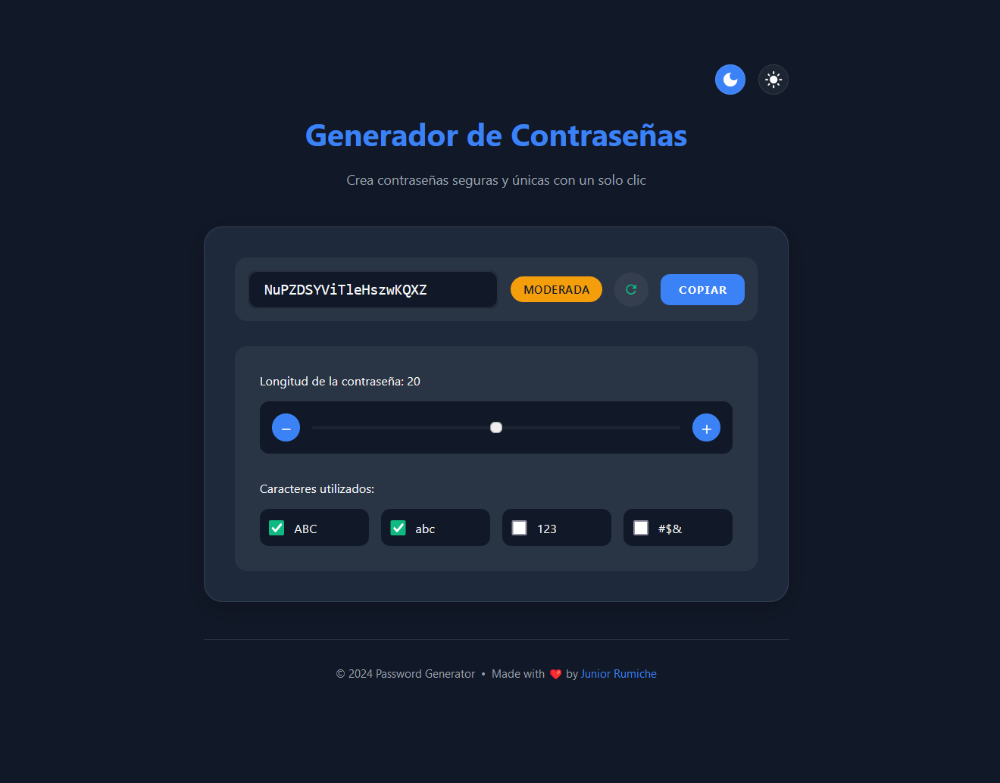

# 🔐 Password Generator

[](https://junior-rumiche.github.io/password-generator)
[](https://opensource.org/licenses/MIT)

A modern and secure password generator with an intuitive interface and customizable options. Generate strong passwords with just one click.



## ✨ Features

- 🎨 Modern design with dark/light mode
- 🔄 Instant password generation
- 📏 Customizable length (8-32 characters)
- 🎯 Flexible character options:
  - Uppercase letters (ABC)
  - Lowercase letters (abc)
  - Numbers (123)
  - Special symbols (#$&)
- 💪 Password strength indicator
- 📋 One-click copy function
- 🌐 Fully responsive interface
- ♿ Enhanced accessibility (ARIA)

## 🚀 Demo

Try the password generator live: [Password Generator Demo](https://junior-rumiche.github.io/password-generator)

## 🛠️ Technologies Used

- HTML5
- CSS3 (CSS Variables, Flexbox, Grid)
- JavaScript (ES6+)
- Responsive Design
- LocalStorage for theme persistence

## 💻 Local Installation

1. Clone the repository:
```bash
git clone https://github.com/junior-rumiche/password-generator.git
```

2. Navigate to the project directory:
```bash
cd password-generator
```

3. Open `index.html` in your preferred browser

## 🔧 Usage

1. Adjust desired length using the slider or +/- buttons
2. Select which character types to include
3. Click the regenerate button for a new password
4. Use the "Copy" button to copy the password to clipboard

## 🤝 Contributing

Contributions are welcome. For major changes:

1. Fork the project
2. Create your feature branch (`git checkout -b feature/amazing-feature`)
3. Make your changes
4. Commit your changes (`git commit -m 'Add: amazing feature'`)
5. Push to the branch (`git push origin feature/amazing-feature`)
6. Open a Pull Request

## 📝 License

This project is licensed under the MIT License - see the [LICENSE](LICENSE) file for details.

## 👤 Author

**Junior Rumiche**

* GitHub: [@junior-rumiche](https://github.com/junior-rumiche)

## 🌟 Acknowledgments

- Inspired by password security best practices
- Design inspired by modern UI/UX trends
- Icons and fonts from Google Fonts

---
⌨️ with ❤️ by [Junior Rumiche](https://github.com/junior-rumiche)
